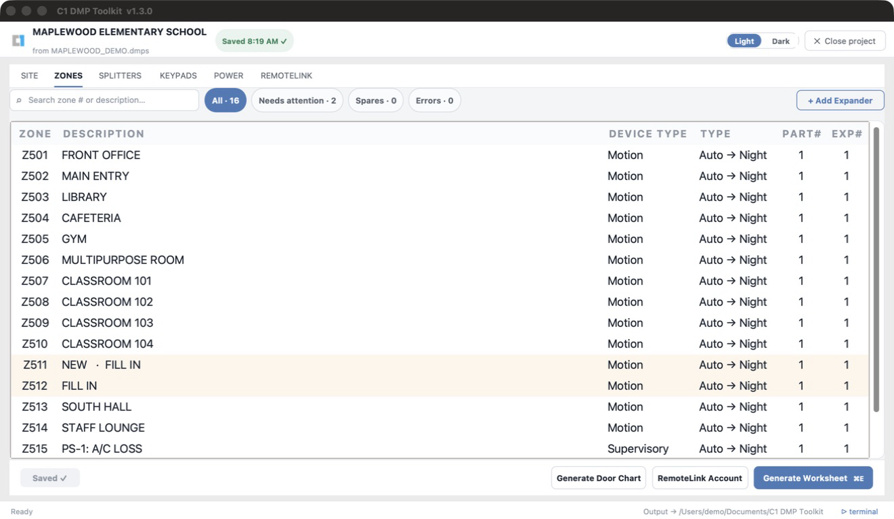
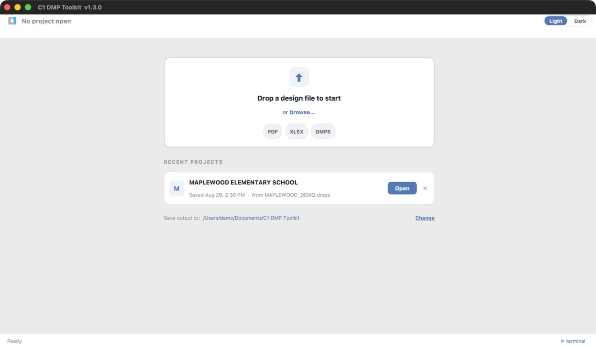
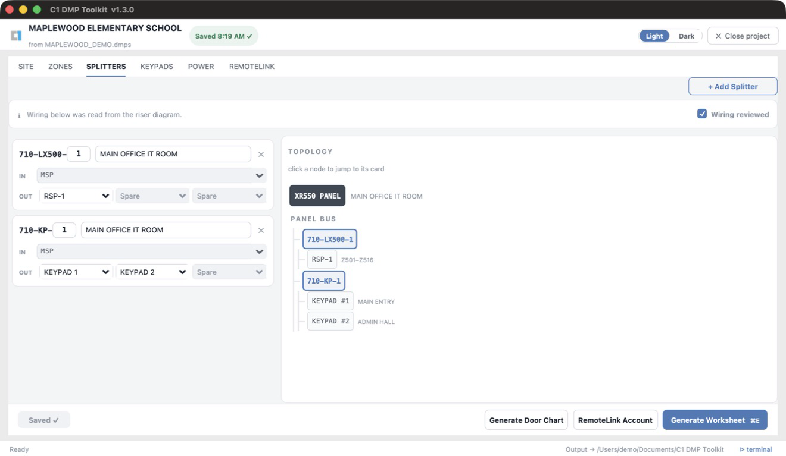
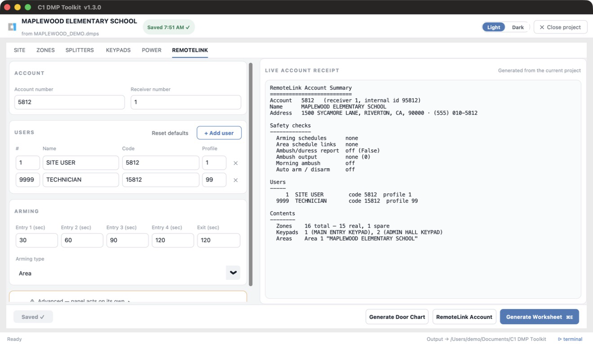
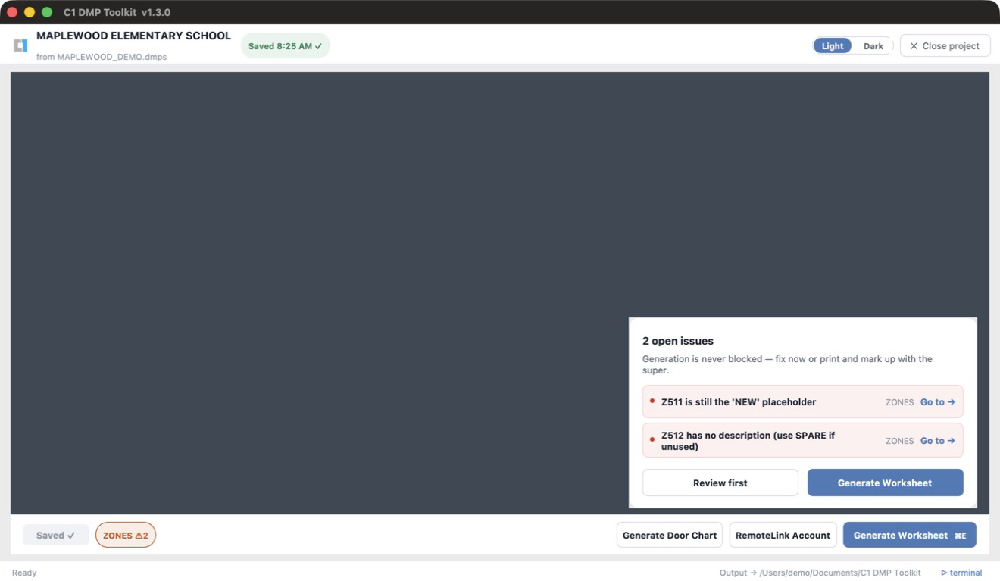
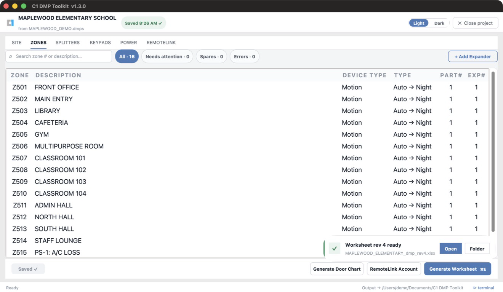

# C1 DMP Toolkit

Desktop app (macOS + Windows) that turns a security-system design PDF into a
**DMP Installation Worksheet**, **Door Chart**, editable **Riser Diagram**, and
encrypted **RemoteLink Account** —
with a built-in editor for correcting the design in the field before anything
is generated.



## What it does

**Inputs** (drag-and-drop or File → Open):

- a security design PDF (OCR'd automatically if it isn't searchable),
- an existing DMP worksheet (`.xlsx`), or
- a saved project (`.dmps`) from a previous visit.

**Outputs** — revision-numbered files, generated on demand from the
editor:

- `school_dmp_rev1.xlsx`, `rev2`, … — the DMP Installation Worksheet
- `school_door_chart_rev1.xlsx`, … — the Door Chart, built from the newest
  worksheet
- `school_riser_rev1_24x36.pdf`, `school_riser_rev1_11x17.pdf`, and
  `school_riser_rev1.svg` — selected riser outputs sharing one revision number

Prior revisions are kept on disk, so the working loop is: **generate → print →
review with the site superintendent → edit → regenerate.**

## Workflow

### 1. Import

Drop a file on the home screen. PDFs are OCR'd if needed, then parsed for the
zone schedule, splitter topology, RSPs, and keypads. The home screen lists
recent projects for one-click reopening across days and site visits.



### 2. Edit

Parsing lands in a tabbed editor — **SITE / ZONES / SPLITTERS / KEYPADS /
RSP/POWER / REMOTELINK / RISER** — which is the working document; generated files are
artifacts and are never re-imported.

- **SITE** — school details plus RemoteLink panel connection, IP, port, and
  serial-number settings.
- **ZONES** — searchable grid with inline editing and filter chips (All /
  Needs attention / Spares / Errors), including the RemoteLink zone type that
  will be programmed for each zone.
- **SPLITTERS** — the wiring topology, CAD-print conflict resolution, and a
  "Wiring reviewed against the riser diagram" checkbox. A read-only **topology
  tree** sits beside the cards so you can verify the derived 710-bus wiring at a
  glance — click any node to jump to the card (or tab) that owns it.
- **Hardware changes** — add or remove **714-16/714-8 expanders** (each brings
  its RSP + power supply + consecutive 16- or 8-zone block), **710 splitters**
  (LX or KP), and **keypads**. New expanders use the first available range that
  fits on one LX bus, then advance to the next bus when needed. Existing zone
  addresses and descriptions stay intact; removal clears only the selected
  expander's zones. Removal re-points
  dependent wiring to Spare and pops a review summary that routes you to the
  affected connections. Location fields autocomplete from locations already in
  the project. Template capacities are enforced: 15 expanders, 12 splitters
  per type, 28 keypads.
- **KEYPADS** — keypad name, device type, displayed areas, and derived bus
  communication settings.
- **REMOTELINK** — account and receiver numbers, users, arming model, and a
  live read-back receipt of exactly what the generated account will contain.
  Advanced settings that can make a panel act on its own stay collapsed behind
  an explicit warning.
- **RISER** — balanced KP/LX auto-layout on one `INT-5.0` sheet, direct device
  and cable editing, topology-aware connect/reconnect, orthogonal route handles,
  markup tools, title-block fields, undo/redo, validation jumps, and an Unplaced
  tray. Electrical changes appear immediately in SPLITTERS and worksheet output.
  **Hide panel / Show panel** collapses the right-side controls to give the
  drawing more room while retaining selections and entered values. **Full screen**
  is available in the riser toolbar and View menu; press **Escape** to exit,
  or toggle with **Ctrl+Cmd+F** on Mac or **F11**. These view changes do not mark
  the project as edited.
  Select a location box and choose **Rename location globally…** (or double-click
  the box) to rename its equipment across the project, with an affected-item
  confirmation and undo. Paired power supplies follow their RSP; unrelated zone
  descriptions are not rewritten. Generate a new worksheet before a new door
  chart to include the corrected locations. Building/Floor/Room fields edit the
  shared physical location; **Assign location** moves only selected equipment's
  assignment. Geometry and wiring remain unchanged.
  **Preview layout** proposes electrical-first room clusters with a centered
  head end, wrapped location headings, and separate unknown-location items.
  **Apply layout** commits one undoable replacement; Cancel changes nothing.
  Existing saved drawings keep their layout until Apply. **Auto-layout** places
  missing equipment into clear space and leaves it Unplaced if no space fits.
- **Validation** runs live (status-bar chips per tab: required IP/gateway/
  tech/date, no blank or placeholder zone descriptions, `RSP-N`/`SPARE`
  naming, conflicts resolved, wiring reviewed). It warns — it never blocks.



### 3. Generate

Buttons at the bottom of the editor (also Worksheet menu / keyboard):

- **Generate Worksheet** (`Cmd/Ctrl+E`) — writes the next worksheet revision.
- **Generate Door Chart** (`Cmd/Ctrl+D`) — builds the chart from the newest
  worksheet, warning if the design has changed since that worksheet was
  generated.
- **Generate Riser** (`Cmd/Ctrl+R`) — choose 11×17 PDF (default), 24×36 PDF,
  and/or editable SVG. Only selected files are generated. Format choices are
  remembered, and the saved output folder is reused automatically; Change folder
  is optional.
- **Generate RemoteLink Account** — builds an encrypted RemoteLink `.xml`
  account export from the settings reviewed across **SITE, ZONES, KEYPADS, and
  REMOTELINK**. The final dialog is deliberately read-only: it shows the
  account/receiver numbers and the same live receipt, then asks only for the
  export **passphrase**. Generation writes both `<code>_remotelink.xml` and a
  matching `<code>_remotelink_summary.txt`; import the `.xml` into RemoteLink
  on Windows — no ODBC driver or direct database access needed.

> **A generated account is not a commissioned panel.** It carries the correct
> zones, keypads, users, connection settings, and selected arming model, but a
> qualified technician must review the receipt and the imported account before
> sending programming to a panel.
>
> The account is stamped from a bundled **demo** template
> (`remotelink_account_template.xml`) that contains no real data — nothing to
> supply. Safe defaults contain no arming schedule, automatic arm/disarm, or
> ambush/duress behavior. If any of those are intentionally enabled under
> **Advanced**, the receipt calls them out and generation verifies the encrypted
> account against the operator's selections before writing it.

Use **Help → Inspect RemoteLink Account…** to open any encrypted RemoteLink
export with its passphrase — no project required. The inspector never changes
the source file; it displays the same readable receipt and can save a summary
for review.

> `.dmps` project files and RemoteLink summary `.txt` files are readable job
> records and include configured panel user codes. Keep them in approved project
> storage; only the generated RemoteLink `.xml` is passphrase-encrypted.



If validation issues are open you get a summary with "Go to" jumps — generate
anyway, or fix things first; your call.



Generation runs in the background — you stay in the editor the whole time, and
a notification offers to open the finished file.



## Projects & saving

Saving is explicit — the Save button or `Cmd/Ctrl+S` writes a `.dmps` project
file (plain JSON) under `<output>/Sessions/`. A debounced background recovery
file guards against crashes; unsaved work is offered for recovery on reopen.
In-app help lives under **Help → Field-Edit Workflow / Keyboard Shortcuts**,
plus hover tooltips on the less obvious controls.

A **light / dark** toggle in the header restyles the whole app instantly and
remembers your choice for next launch.

### Opening older projects

The combined release opens projects from the original app, the RemoteLink
integration, and the riser integration. Saving keeps both RemoteLink settings
and the editable riser (connections, layout, routes, and markup) together.
Combined projects use **schema 8**, including stable shared equipment locations,
versioned riser location ownership, independent cable-callout visibility, and
detailed symbol/port geometry with printed location-frame visibility, and pinned RSP input sides;
older builds will ask you to update
instead of opening a project they cannot preserve. Keep a copy of the original
`.dmps` if you need to continue using an older build.

### Selecting items in RISER

Use **Select** to click an item. **Command-click** on Mac (or **Ctrl-click** on
Windows) adds or removes individual items. Drag from empty space to select items
fully inside a box; hold the same modifier to add the boxed items to the selection.
**Select All** or **Command-A / Ctrl-A** selects items on visible drawing layers,
including items outside the current view. These shortcuts apply when the drawing
has focus; text fields keep their normal text-selection shortcuts.

Drag a selected item or use the arrow keys to move the whole selection. Locations
and their selected devices move once, connected wires stay attached, and a group
move takes one Undo. **Escape** cancels an active drag and clears the selection.
Select one item for individual properties, deletion, or markup duplication.

### RSP wire attachment in RISER

RSP inputs can attach at the midpoint of any side. Moving an RSP in **Auto** mode
chooses a clear approach and keeps its wire outside the symbol. Select the wire
and drag its RSP endpoint onto a side marker to pin that side. These markers are
four drawing positions for the same electrical input. Numbered splitter outputs
keep their separate electrical connections.

Select the RSP and use **Input side → Auto** to restore automatic placement, or
choose Top, Right, Bottom, or Left. Side choices support Undo/Redo and are saved
with the project; exports use the same attachment geometry.

### Hardware and cable callouts in RISER

New drawings use schematic keypad faces, compact 710s with inside location
captions, and a structured title block. To adopt the style in a saved drawing,
choose **Preview layout**, review it, then **Apply layout** (undoable). Opening
an older project does not replace its saved manual geometry. Long location
captions can grow detailed symbols to keep text readable. **Locations** shows
or hides group outlines in both the editor and exports; detailed drawings hide
these outlines by default. Electrical connections remain unchanged.

- **Add Device** opens the existing splitter, keypad, or RSP/power-supply creation
  form. New equipment appears in **Unplaced**; existing drawing positions stay put.
- Select a device and choose **Edit Device**, or double-click its symbol. The same
  forms used by the domain tabs edit the shared project immediately. **Done** closes
  the form; it is not a separate draft. **Remove from Project** uses the existing
  wiring/zone-cascade confirmation. The required MSP cannot be removed.
- Select cable text independently to drag or arrow-key nudge it. Double-click
  edits its text; blank restores the automatic cable label. **Delete** on selected
  text hides only the callout. Deleting a selected wire still asks to disconnect it.
- Select the wire for **Restore Label**, **Hide Label**, and **Reset Label Position**.
  Callout movement/visibility supports Undo/Redo and Escape during a drag, persists
  in the project, and matches both PDF sizes and SVG. Full Preview/Apply layout
  replaces manual positions but preserves hidden labels.
- Hardware forms retain the domain tabs' existing history behavior; adding/removing
  hardware is not a canvas Undo command. Save a project copy before major hardware changes.

## Repository layout

| Path | Purpose |
|---|---|
| `scripts/` | All Python source (one cross-platform copy) |
| `scripts/rl_injector/` | RemoteLink document model, safety verification, inspector, and encrypted `.xml` export |
| `dmp_doorchart.spec` | PyInstaller build spec (OS-branched internally) |
| `requirements.txt` | Pinned dependencies — build with **Python 3.13** |
| `VERSION` | App version, shown in the title bar |
| `build_mac.command` / `build_windows.bat` | Per-machine build scripts |
| `.github/workflows/release.yml` | CI: builds both OSes on a version tag |
| `logos/`, `*.xlsx` | Branding assets and Excel templates |
| `docs/screenshots/` | README images (demo data only) |
| `docs/` | Design specs |

Build output, virtualenvs, and working data are **not** committed — see
`.gitignore`. One codebase runs on both operating systems — platform
differences are handled at runtime via `sys.platform` checks.

> **Data hygiene:** this repository is public. `input/` is gitignored on
> purpose — never commit real school design files, worksheets, or screenshots
> containing them. README screenshots use a fabricated demo project.

## Developer setup (new machine)

1. Install **Python 3.13** and **Git** (or GitHub Desktop).
2. Install the OCR tools:
   - macOS: `brew install tesseract ghostscript`
   - Windows: Tesseract-OCR (UB Mannheim build) and Ghostscript, default paths.
3. Clone this repo (anywhere **outside** OneDrive, e.g. `~/Projects/`).
4. Build:
   - macOS: double-click `build_mac.command` → app installed to `~/Applications/`
   - Windows: double-click `build_windows.bat` → app folder copied to your Desktop
5. Launch the built app.

The build script creates its own virtualenv at `~/.dmp-doorchart/` (local, never
synced). First build takes a few minutes; rebuilds are faster.

**Updating:** `git pull`, then re-run the build script — or download a build
from GitHub Releases.

## Releasing

Push a version tag to build both platforms via CI and publish a Release:

```
# bump VERSION first (e.g. to 1.0.9), commit, then:
git tag v1.0.9
git push origin v1.0.9
```

GitHub Actions builds the macOS `.app` and Windows `.exe` and attaches both to a
GitHub Release for that tag. The Release is the version archive. CI fails fast if
the pushed tag doesn't match the `VERSION` file, so the two can't drift.

## Auto-update

Once a colleague has any packaged build installed, it **updates itself** — no more
re-sending zips. On launch (throttled to once/day) the app checks the public
GitHub Releases API; if a newer release exists it shows an *"Update available"*
dialog with the release notes and an **Update Now** button that downloads the new
build, swaps the running app in place, and relaunches. **Later** just closes the
dialog — the daily check re-prompts on the next launch — while **Skip this
version** silences that one release for good. A manual **Help → Check for
Updates…** always works regardless (it ignores a skipped version).

Because the app downloads the update itself, the new build opens **without** the
Gatekeeper / SmartScreen warning seen on the first manual install. Releasing is
unchanged: bump `VERSION`, tag `vX.Y.Z`, push — every existing install picks it up.
(The updater is stdlib-only; see `scripts/updater.py`.)

## Sharing with a colleague (Windows, no install)

The Windows build is a **self-contained app folder** — it bundles Python, all
libraries, and the OCR tools (Tesseract + Ghostscript). The recipient needs
nothing installed. It ships as a `.zip` (one folder holding the `.exe` plus an
`_internal/` folder of bundled files).

To share: download `C1-DMP-Toolkit-Windows.zip` from the GitHub
Release and send it over **Teams** (email servers block executables). They:

1. Save the `.zip` and **extract it** (right-click → Extract All). Keep the
   `.exe` and the `_internal/` folder together — the app needs both.
2. Open the extracted folder and double-click the `.exe`.
3. If Windows SmartScreen shows "Windows protected your PC", click
   **More info → Run anyway** (one click, not an install).

They never touch GitHub or the source code.

The build is deliberately **one-folder** (not one-file) and **UPX-free** so it
is not blocked by AppLocker `%TEMP%` rules or flagged as a false positive by
antivirus on managed/corporate Windows machines.

## Output location

Generated worksheets and door charts are written to a folder the user picks
in-app (**"Save output to → Change…"**), stored per machine. The default is
`~/Documents/C1 DMP Toolkit/`. Each generate writes the next
`_revN` file rather than overwriting, so earlier revisions stay available for
comparison. Point the folder at OneDrive to sync deliverables across machines,
or keep it local.
